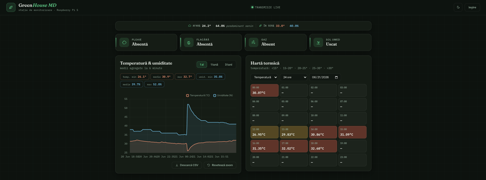
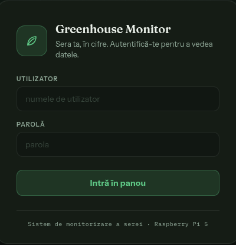

# Greenhouse Monitor System

A complete IoT monitoring system for a greenhouse, built on a **Raspberry Pi 5**.
Six physical sensors feed a PostgreSQL database in real time; a Flask web
dashboard and a local TFT screen both visualize the data, and a Telegram bot
sends alerts when something needs attention.

Built as a bachelor's thesis project — designed, wired, and coded from
scratch, including a fair amount of hardware debugging along the way.

---

## Features

- **Six sensors monitored continuously**: temperature & humidity (DHT11),
  rain, soil moisture, combustible gas (MQ-6), and flame detection.
- **Smart data aggregation** — raw DHT11 readings are averaged into 6-minute
  windows, cutting stored data volume by 36× with no meaningful precision
  loss.
- **Web dashboard** with time-series charts (1 day / 1 month / 3 months),
  hourly and monthly heatmaps, CSV export, and live status cards that
  auto-refresh every 5 seconds.
- **Local TFT display** (1.8" ST7735S) showing climate and sensor status
  directly on the device — no browser required.
- **Telegram alerts** with per-event cooldown, so a stuck sensor doesn't spam
  your phone.
- **Audible alarms** via an active buzzer, with a distinct sound pattern per
  event type (continuous tone for fire, SOS pattern for gas, short beeps for
  rain).
- **Outside weather comparison** pulled from Open-Meteo (no API key
  required), shown side-by-side with greenhouse readings.
- **Alert history** reconstructing fire/gas events with start time and
  duration from the raw sensor transitions.
- **Dark / light theme toggle**, persisted across sessions.
- Runs entirely offline except for Telegram notifications and the outside
  weather lookup — no cloud dependency for core functionality.

---

## Screenshots

| Dashboard | Login | DisplayTFT |
|---|---|---|
|  |  | | 

---

## Architecture

The system runs as three independent processes, each managed by `systemd`,
communicating exclusively through the PostgreSQL database:

```
┌──────────────────────────────────────────────────────┐
│                   Raspberry Pi 5                     │
│                                                      │
│  Sensors (GPIO)                                      │
│       │                                              │
│       ▼                                              │
│  greenhouse_monitor.py ───────────────►  PostgreSQL  │
│                                              │       │
│  display_monitor.py    ◄─────────────────────┤       │
│                                              │       │
│  app.py (Flask + gunicorn) ◄─────────────────        │
│       │                                              │
│       ▼                                              │
│  Web browser (any device on the LAN)                 │
│  TFT display (local, on the Pi itself)               │
└──────────────────────────────────────────────────────┘
```

A crash in any one process doesn't affect the others — `systemd` restarts
the failed service automatically (`Restart=on-failure`).

---

## Hardware

| Component | Model | GPIO (BCM) | Physical pin |
|---|---|---|---|
| Board | Raspberry Pi 5 | — | — |
| Temperature/humidity | DHT11 | GPIO4 | 7 |
| Rain sensor | Digital module | GPIO17 | 11 |
| Buzzer | Active buzzer | GPIO18 | 12 |
| Flame sensor | IR flame sensor | GPIO27 | 13 |
| Gas sensor | MQ-6 (LPG/butane) | GPIO22 | 15 |
| Soil moisture | Digital module | GPIO23 | 16 |

### TFT display (ST7735S, 1.8", 160×128, 11-pin module)

| Module pin | Signal | GPIO (BCM) | Physical pin |
|---|---|---|---|
| 1 | VCC | 3.3V | 17 |
| 2 | GND | GND | 6 |
| 3 | GND | GND | 14 |
| 4–6 | NC | — | not connected |
| 7 | CLK | GPIO11 (SPI SCLK) | 23 |
| 8 | SDA | GPIO10 (SPI MOSI) | 19 |
| 9 | RS (CS) | GPIO5 | 29 |
| 10 | RST (DC) | GPIO25 | 22 |
| 11 | CS (RST) | GPIO24 | 18 |

> Note: the silkscreen labels on this particular module (RS/RST/CS) don't
> map 1:1 to the usual DC/RST/CS naming — the table above reflects the
> pinout that was confirmed working through hardware testing, not the
> module's printed labels.

---

## Tech stack

**Backend** — Python 3.11+, Flask, gunicorn, PostgreSQL, psycopg2, pandas

**Hardware** — gpiozero, adafruit-circuitpython-dht,
adafruit-circuitpython-rgb-display, Pillow

**Frontend** — vanilla HTML/CSS/JS, Chart.js (+ zoom/pan plugin), inline SVG
icons (no external icon dependency)

**Infrastructure** — systemd (autostart + auto-restart), python-dotenv
(configuration), werkzeug (password hashing)

**External APIs** — Telegram Bot API (alerts), Open-Meteo (outside weather,
free, no key required)

---

## Quick start

```bash
git clone https://github.com/your-username/greenhouse-monitor.git
cd greenhouse-monitor

python3 -m venv venv
source venv/bin/activate
pip install -r requirements.txt

cp .env.example .env
# edit .env: DB credentials, FLASK_SECRET, GH_PASS_HASH (see generate_hash.py)

psql -U pi_user -d greenhouse -f schema.sql

python3 greenhouse_monitor.py &
python3 app.py
```

Full step-by-step instructions, including systemd autostart setup, are in
[`INSTALL.md`](INSTALL.md).

---

## Project structure

```
greenhouse-monitor/
├── app.py                      # Flask web server + REST API
├── greenhouse_monitor.py       # sensor reading loop -> PostgreSQL
├── display_monitor.py          # TFT display loop
├── generate_hash.py            # utility: create the dashboard password hash
├── schema.sql                  # database schema
├── requirements.txt
├── .env.example                # configuration template (copy to .env)
├── templates/
│   ├── index.html
│   └── login.html
├── static/
│   ├── style.css
│   └── dashboard.js
├── deploy/
│   ├── greenhouse-monitor.service
│   ├── greenhouse-web.service
│   └── greenhouse-display.service
├── INSTALL.md
└── LICENSE
```

---

## API reference

All endpoints except `/login` and `/api/ingest` require an authenticated
session.

| Endpoint | Method | Description |
|---|---|---|
| `/` | GET | Main dashboard |
| `/login` | GET/POST | Authentication |
| `/api/timeseries` | GET | Temperature/humidity series (`?range=day\|month\|3months`) |
| `/api/heatmap` | GET | Hourly or monthly heatmap |
| `/api/status` | GET | Live sensor status (polled every 5s by the dashboard) |
| `/api/events` | GET | Rain/soil event history for a date range |
| `/api/alerts` | GET | Fire/gas alert history with duration |
| `/api/weather` | GET | Outside weather (Open-Meteo, 10-min cache) |
| `/api/export` | GET | CSV download for the selected interval |
| `/api/ingest` | POST | External data ingestion (API key, rate-limited) |

---

## Known limitations & future work

- Single-user authentication — no role-based access control.
- DHT11 precision (±2°C, ±5% RH) may be insufficient for crops requiring
  tight microclimate control; swapping in a DHT22 is a drop-in upgrade.
- No automated data archiving — for multi-year deployments, partitioning the
  `sensor_readings` table would help.
- Planned: automated irrigation control via a GPIO-driven solenoid valve,
  triggered when soil moisture drops below a configurable threshold.

---

## License

MIT — see [LICENSE](LICENSE).
